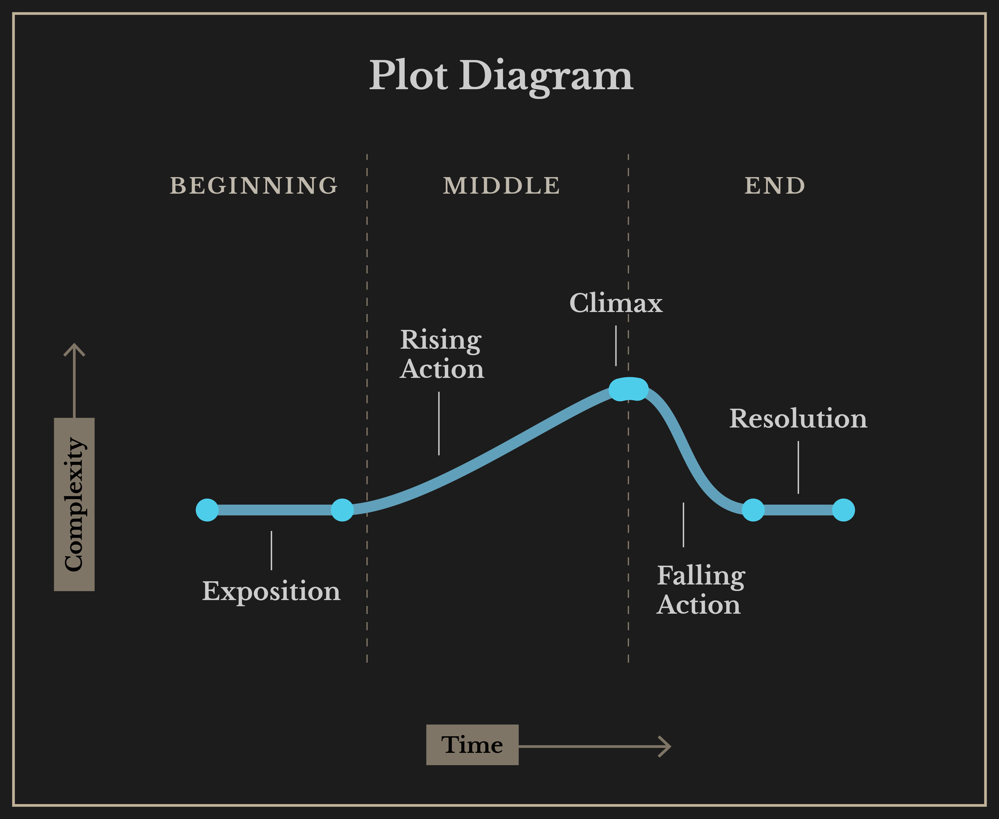
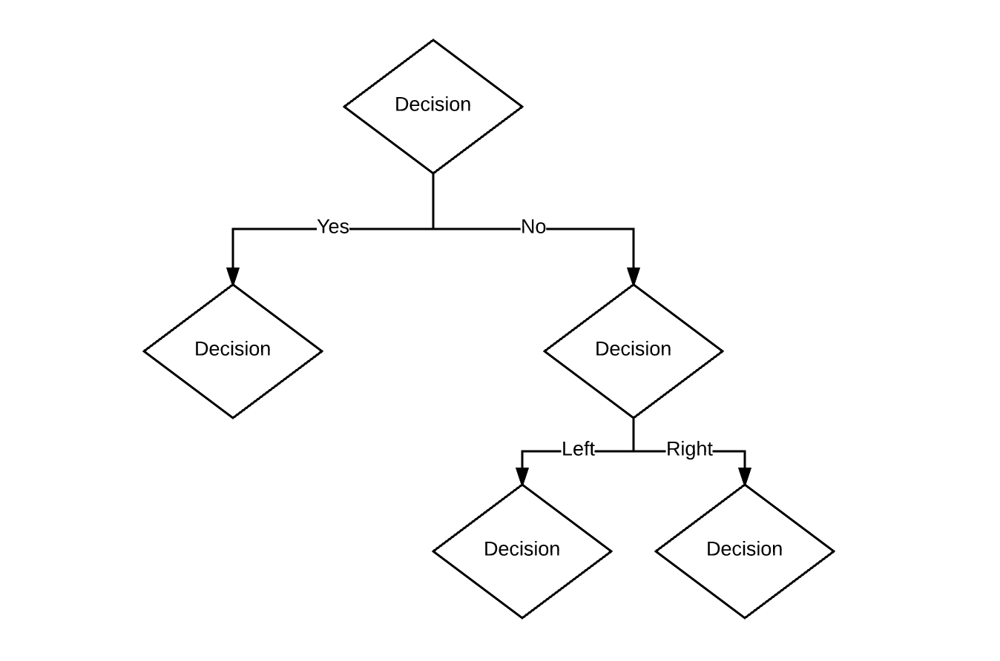
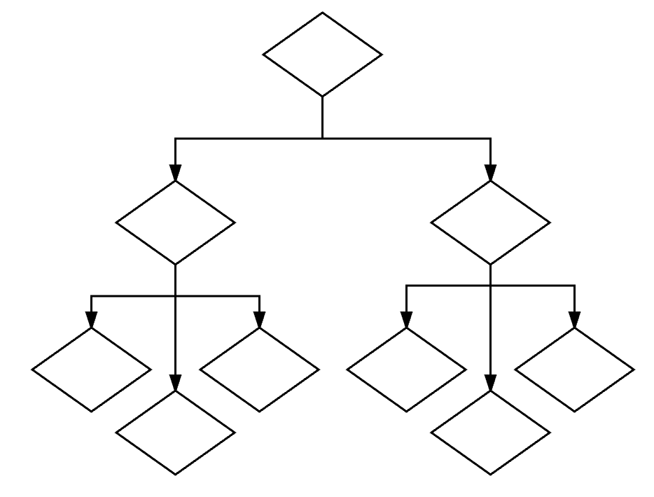
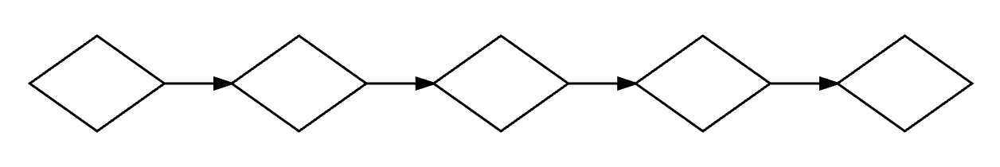
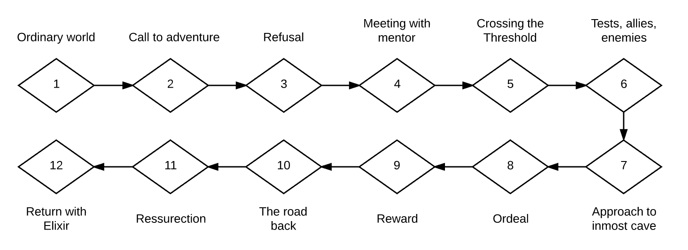
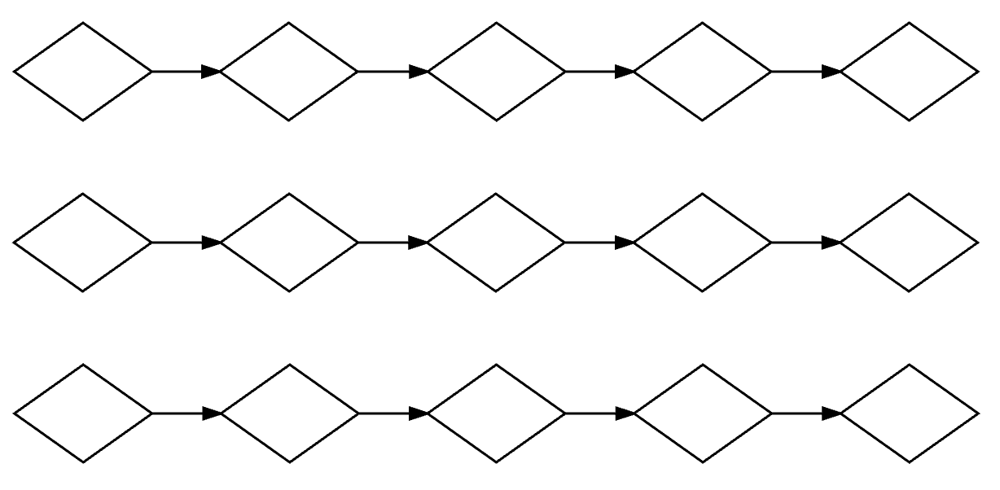
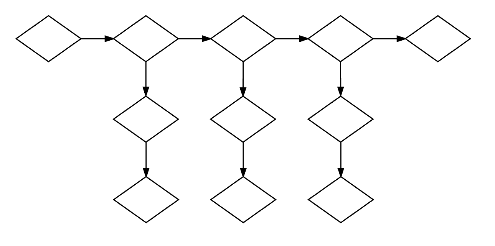
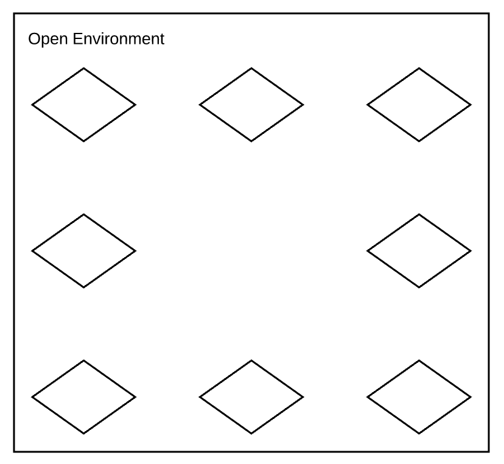
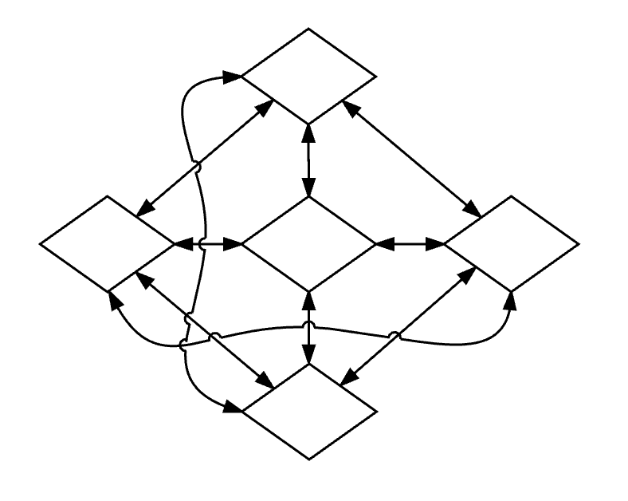

# What is a story?

A story is a sequence of events and can be temporal \(happen within the viewer's mind\) or spatial \(occur physically\). A story \(sequence of events\) is expressed through narration, or the recounting of events. A narrative is a method of telling a story and is tangible. We know that a narrative is tangible because we can perceive the telling of stories through written text, sound, performance, image, etc. A narrative account of a split-second could last for the entire retelling whereas an event that lasted 100 years could be retold in a few seconds. Narrative places emphasis, focus, and perspective for stories. A plot is the connective tissue between story events, describing the causal relationships and context for viewers.

* **Story:** A sequence of events. Can occur spatially or temporally.
* **Plot:** Creates meaning by connecting story events with context.
* **Narrative:** Method of telling story.

Watch Kurt Vonnegut's humorous lecture on storytelling. [Shapes of Stories \(4:36\)](https://www.youtube.com/watch?v=oP3c1h8v2ZQ)

### Example Story:

Below, I have written a story \(based on real events\). I then described the plot of the story, and used written narrative to tell a single moment in the story from a third person Point of View.

#### **Story**

\(1\) A new family sets off on a routine, but potentially dangerous voyage. \(2\) Their baby gets sick \(3\) Their vessel takes on water. \(4\) They call for help. \(5\) They get rescued and face public scrutiny

#### **Plot**

Simon and Mary, along with their newborn child, plan to cross the Pacific Ocean in their sailboat–a journey they have done many times. They take all necessary precautions before the trip. Despite being cleared for travel, their baby gets a fever. There is a harsh storm that damages their sailboat and it began taking on water. With a damaged boat, a sick child, and no means of communication, they turn on a rescue beacon. The rescue team arrives in helicopter and they abandon their sailboat. They must then defend themselves from public scrutiny related to child endangerment and the high cost of a rescue at sea.

#### **Written story narrative**

"The waves have been crashing against the hull for hours. This has to be the worst storm we've ever sailed through," Simon thought to himself. To his horror, sea water begin to pour in through a crack at the base of the mast. He pulled the bright orange emergency beacon out of its case and looked at it. He looked over at Mary, who was sitting at the back of the cabin, cradling their infant. "If we turn the beacon on, it's all over," he yelled. She nodded, confirming the heavy weight of the decision. After all, it wasn't just a boat, it was also their home and they were about to abandon it. Forever.

### Narrative structure

A narrative structure orders or disorders the events of a story for the audience, and combines those events with plot. A linear narrative is chronological, whereas a non-linear narrative is non-chronological. There are commonly used frameworks for storytelling which started with Aristotle's three-part structure consisting of a beginning, middle, and end. From there, structures become more nuanced and descriptive.

Stories are big business. Hollywood films tend to have structural models that traditionally sell well in the box office, increasing the probability that they will see a return on the production investment. The perception is that experimental or uncommon narrative structures tend to be risky. The same can be said for large game developers who are inclined to produce sequels of top-selling titles.

This can explain why many of the boundary-pushing films tend to come from independent authors and screenwriters, indie game developers, and indie filmmakers. They have less of a financial stake in the outcomes of sales, and are more likely to focus on new modes of expression, craft, and originality of content.

## Dramatic structure

Gustav Freytag \(1816 - 1895\), a German dramatist and novelist, developed a structure for the way stories are told in ancient Greek and Shakespearean drama. This analysis is known as Freytag's analysis, dramatic structure, or Freytag's Pyramid. His analysis consisted of the following five acts:

1. exposition
2. rising action
3. climax
4. falling action
5. dénouement/resolution

This five-act structure works well when describing Greek and Shakespearean plays. However, there are many ways to analyze the structure of a narrative. Most contemporary stories can be described with according to common structural breakdowns – the Three Act, Four Act, Five Act, Seven Act, and Hero's Journey. These structures can help us understand how a story is told, and act as a heuristic for writing your own story.

### Three Act

1. Beginning
2. Middle
3. End

#### Three Act Plot Diagram

The following Plot Diagram shows the Five Act plot points laid over a Three Act structure.

### Four Act

1. Inciting incident
2. First Act Turn to Second Act Turn
3. Second Act Turn to Third Act Turn
4. Third Act Turn to Resolution

### Five Act

1. Exposition
2. Rising action
3. Climax
4. Falling action
5. Resolution

### Seven Act

1. Backstory
2. Catalyst
3. Big event
4. Midpoint
5. Crisis
6. Climax
7. Realization

### Hero's Journey

1. The ordinary world
2. Call to adventure
3. Refusal of the call
4. Meeting with the mentor
5. Crossing the threshold
6. Tests, allies, and enemies
7. Approach
8. The ordeal
9. The reward
10. The road back
11. The resurrection
12. Return with the elixir

### Non-linear narrative structures

A non-linear structure is not necessarily chronological or cause-and-effect based. Story is unfolded simultaneously and recursively. Non-linear narratives are often used to create links between things that are otherwise not connected to create meaning or tension, a device used commonly in surrealism.

### Interactive narrative

The story you experience in an interactive narrative work is not predetermined. The story path is chosen based on a viewer's choices. In video games, the number of story events that can be chosen through interaction can be quite high, making subsequent play-throughs unique. Newer games rely on generative algorithms and artificial intelligence to create the environment around these choices.

#### Decision nodes

An interactive narrative is comprised of decision or action points called nodes, where the user impacts the unfolding of the narrative by making a choice or performing an action. The choice the user makes can determine which branching narrative path is taken. The decisions themselves are part of the plot, which handles dramatization of the events.

For example, let's say you are playing a hypertext narrative, and your character is a young woman who sees a hooded figure shoplifting. The options to proceed include a\) tell the shopkeeper, b\) follow the shoplifter, or c\) do nothing. Depending on which choice you select, the story will progress through on one of three branching paths.

#### Critical story path

A critical story path can be thought of as the shortest path possible through a series of decision nodes to complete the interactive story.

**To develop the critical path:**

1. All the critical story beats must be accounted for
2. Determine essential actions and decisions
3. Identify the optional narrative interactions that build around the central story

#### Linear narrative structural models

##### Branching

The branching structure is the structure used in "choose your own adventure" books and most interactive narratives. One problem with branching structures is the tendency to create overly complicated story paths.

##### String of pearls

In this linear structure, a user must complete node's requirements to continue to the next node.

##### Hero's journey

  
In this linear structure, a user would follow the 12 stages of the hero's journey. However, there can be fewer or additional stages and still be considered a journey structure. Some stories continue around this path, creating a continuous.

##### Parallel worlds

In this quasi-linear structure, users are given the opportunity to explore multiple storylines running in parallel. There is typically no way to experience all of the stories at once, though they may intersect at opportune times.

##### Drill-down

The drill-down is a bi-linear structure and encourages users to move through a story vertically and laterally, where lateral movement represents plot points and vertical movement represents the gathering additional details about the plot.

#### Non-linear structural models

##### Sandbox or open-world

A sandbox structure is one where the story unfolds based on how a player chooses to interact in what is typically a large, open environment. This is a loose structure where the setting of the story often becomes central to the experience.

##### Graph

  
A graph structure is where all nodes simultaneously connect with every other node bi-bidirectionally. Discerning a plot causality in such a structure can be difficult.

#### Creating your own structural model

Quite often, no perfect model exists for the kind of story that needs to be told. Part of the creative process for writing a narrative is producing the model that can best support the story.

## Citation

1. [Digital Storytelling: A Creator's Guide to Interactive Entertainment. Carolyn Handler Miller. 2014. ISBN-10: 0415836948](http://www.amazon.com/Digital-Storytelling-creators-interactive-entertainment/dp/0415836948)
2. [On Story, Plot, and Narrative in Games](https://livewareblog.wordpress.com/2013/09/09/on-story-plot-and-narrative-in-games/)
3. [There is no such thing as narrative art](http://www.bu.edu/arion/volume-18-barolsky-narrative-art/)

