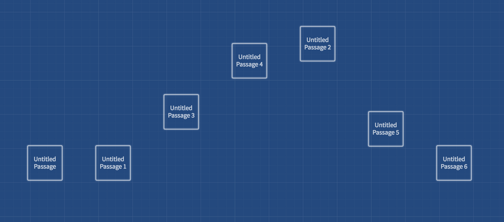

# Twine tutorial: Getting started with Twine

In this tutorial, you will be guided through the steps to create a simple hypertext Twine story.

## Creating linked passages

1. Go to [https://twinery.org/](https://twinery.org/).
2. Click on [Use it online](https://twinery.org/2/).
3. Add a new story and give it a name.
   * If you've done this correctly, a blue grid will appear with an example passage.
4. Double click on _**Untitled Passage**_ to go into edit mode.
5. Rename _**Untitled Passage**_ to _**Start**_.
6. Type the following text into the body: `I had my head in, and was about to open the lantern, when my thumb slipped upon the tin fastening, and the old man sprang up in bed, crying out: [["Who's there?"]]`
7. Press escape or click the x to close edit mode.
   * You will see that a new passage has been created automatically called _**"Who's there?"**_
   * The untitled passage should now be named _**Start**_.
8. Double click on _**"Who's there?"**_ to go into edit mode.
9. Type the following text into the body: `I kept quite still and said nothing. For a whole hour I did not move a muscle, and in the meantime I did not hear him lie down. He was still sitting up in the bed listening;--just as I have done, night after night, hearkening to the death watches in the wall. [[Go Back|Start]]`
10. Press escape or click the x to close edit mode.
11. Press the Play button to test the story.
12. Publish the story to HTML by clicking on the story's name at the bottom left and choosing publish from the menu.

## Using Twinery's grid to visualize a the story's shape

1. Write out the main plot points of the story on paper or a text editor.
2. In [Twinery.org's editor](https://twinery.org), create a new passage for each major plot point horizontally across the screen.
3. Move the passages vertically up and down to create a visualization for rising and falling action. If you run out of space on the screen, you can decrease the size of the grid by choosing one of the other grid/block icons on the bottom menu bar.  
     
4. Edit each passage and write in the passage details and links.
5. Read through your story to see if the plot points match the intended rising and falling action. Make adjustments accordingly.

